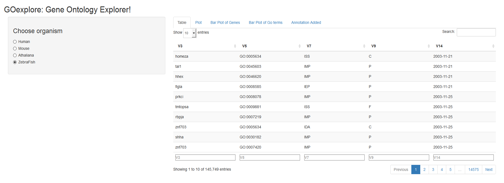
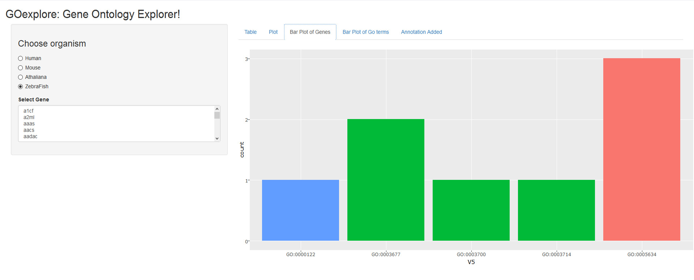
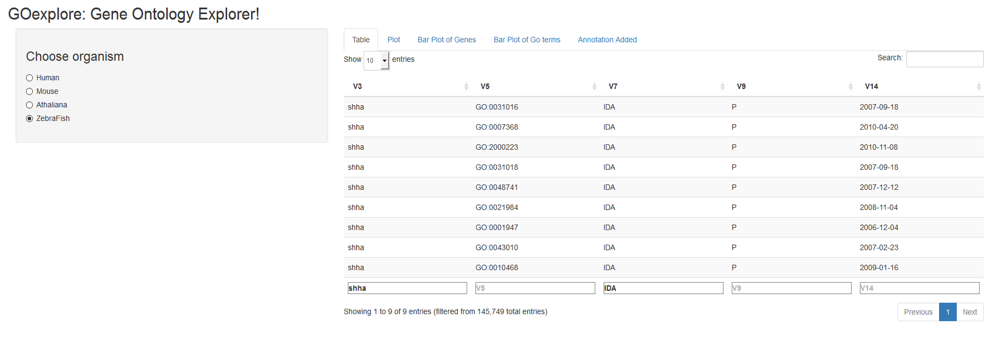
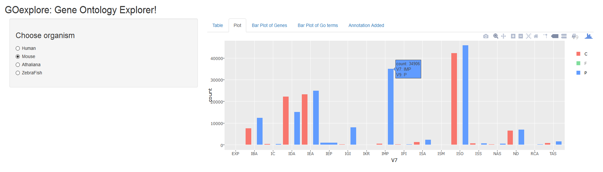

```{r setup, include=FALSE}
knitr::opts_chunk$set(echo = TRUE, tidy = TRUE, eval = FALSE)
```

# Abstract

A fundamental aim of genetics is to understand the functions of proteins which is critical for understanding the molecular basis of diseases and other phenotypic traits. The Gene Ontology (GO) Consortium provides controlled vocabularies of defined terms representing gene product (protein) properties. These GO terms assigned to genes as annotations describe three aspects of the gene: 1) Cellular Component; 2) Molecular Function and; 3) Biological Process. The gene annotations assign GO terms to the genes along with an evidence code that depict the strength of the annotation. Some evidence codes are more reliable than others, for instance, annotations derived from experimental evidence codes are more valid than those derived from automatic analyses. A typical gene annotation data provides association details for thousands of genes and GO terms with the aspect, evidence codes, literature citation, date and assigned by among others. The evidence code, aspect, gene and GO terms are multi-factor variables making them a perfect choice for exploring the quality of the data using their combinations. Because there can be multiple evidences supporting the relation between a gene and a GO term, the annotations are redundant. I'll write functions to remove the redundancy and other inherent biases in the annotations data. The aim of this project is to develop a shiny app to provide an intuitive access to the gene annotation data by means of providing descriptive visualization. Since the GO annotations are regularly updated, the app will always fetch the latest annotations when invoked to provide analysis using the current annotations. The platform will also provide an easy to use interface for comparing the quality of annotations across species.

# Gene Ontology

The GO project is an extensive resource for functional genomics. It provides evidence-supported annotations for gene products using ontologies to describe the biological roles of these gene products. GO is structured as a Directed Acyclic Graph (DAG), where every node represents a GO term which have defined relationships with one or more terms. GO describes three aspects of the gene products:

- **Cellular Component**- cellular locations where these occur
- **Molecular Function**- molecular level elemental activities
- **Biological Process**- series of one or more molecular events

A *GO annotation* describes the association between an aspect of the ontology and a gene product, as well as the references to the evidence supporting the association. These evidences are of varying quality depending on the underlying source and are categorized into the following five groups:

- **Experimental**
- **Computational**
- **Author Statements**
- **Curatorial Statements**
- **Automatic**

## The GO data description

The GO project provides tab-separated annotation files for several species through their website, http://www.geneontology.org/page/download-annotations. For the purpose of this project, I downloaded the datasets for four commonly studies species, Humans, Mouse, Arabidopsis thaliana and Zebra fish. The GO annotations contain information more than 10 variables. For this study, I plan to use only five variables; Gene Symbol, GO term, Evidence Code, Aspect and Date annotation added.

A GO term can be associated with only one Aspect, while a Aspect has multiple GO terms describing it. Genes have many-to-many relation with GO terms, Aspect, Evidence and Date. Aspect and GO terms have a many-to-many relation with Evidence.

The first step in the Shiny App is to read these annotations and store them as data frames. The following code chunks perform this:

```{r}
HSA <- unique(read.table(gzfile("../data/goa_human.gaf.gz"),skip = 34, header = F, sep = "\t", strip.white = F, stringsAsFactors = T, skipNul = T, quote = "",comment.char = "")[,c(3,5,7,9,14)])
MMU <- unique(read.table(gzfile("../data/gene_association.mgi.gz"),skip = 47, header = F, sep = "\t", strip.white = F, stringsAsFactors = T, skipNul = T, quote = "",comment.char = "")[,c(3,5,7,9,14)])
ATH <- unique(read.table(gzfile("../data/gene_association.tair.gz"),skip = 24, header = F, sep = "\t", strip.white = F, stringsAsFactors = T, skipNul = T, quote = "",comment.char = "")[,c(3,5,7,9,14)])
ZFN <- unique(read.table(gzfile("../data/gene_association.zfin.gz"),skip = 28, header = F, sep = "\t", strip.white = F, stringsAsFactors = T, skipNul = T, quote = "",comment.char = "")[,c(3,5,7,9,14)])
```

The files provided by the GO project are gzip compressed. I tried reading in the compressed as well as the uncompressed files and the difference wasn't very big (usually less than one second for a file), so I decided to read in the compressed files (GitHub was getting angry when I was uploading multiple ~70mb files). I'm storing only the 5 variables discussed above to speed-up the Apps. These files contain several lines of meta-information and it differs across species. Hence, I had to hard-code these with the `skip = XX` parameter.

# Dependencies and Availability

The shiny Apps depend on the following external packages:

- shiny
- ggplot2
- plotly
- readr
- lubridate

The Apps are available through [GitHub](https://github.com/Gkandoi/STAT585X/tree/master/Project) for research purposes only. To run the Apps, use the following commands:

```{r}
## For GOexplore
if (!require('shiny', 'ggplot2', 'plotly', 'readr')) install.packages("shiny", "ggplot2", "plotly", "readr")
if (!require('lubridate')) install.packages("lubridate")
shiny::runGitHub("STAT585X", "Gkandoi", subdir = "Project/GOexplore")
```

```{r}
## For GOcompare
if (!require('shiny', 'ggplot2', 'plotly', 'readr')) install.packages("shiny", "ggplot2", "plotly", "readr")
shiny::runGitHub("STAT585X", "Gkandoi", subdir = "Project/GOcompare")
```

# GOexplore

The first App, GOexplore, lets a user browse through the annotations while also generating interactive graphics. The figure 1 is the screenshot of the landing page.



It consists of three sections:

* **Sidebar Panel:** On the homepage, the user is presented with a choice to select the organism. The sidebar panel is conditional and updates based on the current tab. For instance, if we go to the *Bar Plot of Genes* tab, we can see a list of gene appear in the sidebar panel. it is shown in figure 2.



* **Tab panel:** The tab panel provides the user to switch between various types of visualization. Currently, there are five tabs:
    + Table: The first tab makes use of the `dataTableOutput` to render the entire annotations as a very interactive and user-friendly table. The user has the capability to search for strings within the entire table using the search button at the top right corner. The user can also filter the annotations displayed by searching in a specific column. Filtering can also be performed by searching in multiple columns. For instance, figure 3 displays the results for the gene *shha* and evidence *IDA*.
    
    
    
    By default, 10 entries are displayed, but there is an option at the top left corner for the user to have the App display 10, 25, 50 or 100 entries. The user can sort the table in ascending/descending order based on any column.
    
    + Plot: The second panel creates a bar plot using the count of annotations for every evidence code colored by the aspect. An example for Mouse is shown in figure 4.
    
    
    
    The plot is created using `plotly` and is thus interactive. As can be seen in figure 4, the user can see the count, the evidence code and the aspect code on hovering over the bars. The legends on the right are reactive and the user can decide to select only a subset of the aspects. If you notice in figure 4, the legend for *Moleculae Function (F)* is grayed out and thus filteres from the plot.
    
    + Bar Plot of Genes: The next tab

- **Main panel:**